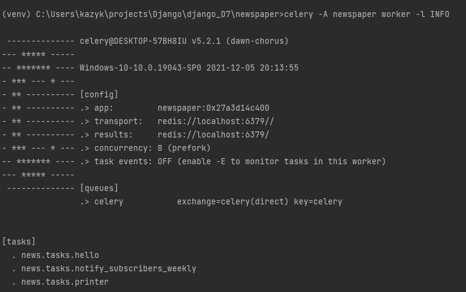
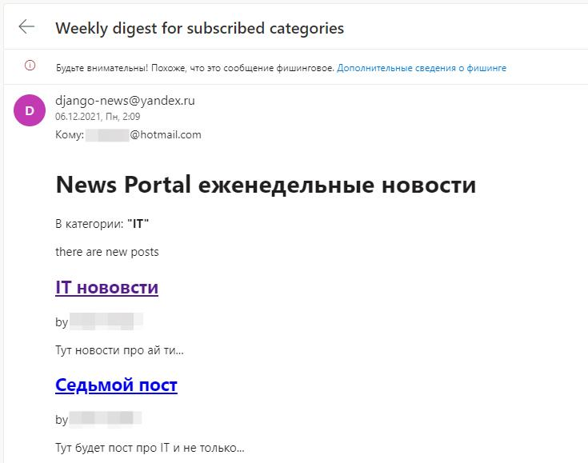

# NewsPaper

## Продолжаем работать над проектом новостного приложения.

Итоговые задания модуля:

- Установить Redis.
- Установить Celery.
- Произвести необходимые конфигурации Django для соединения всех компонент системы.
- Реализовать рассылку уведомлений подписчикам после создания новости.
- Реализовать еженедельную рассылку с последними новостями (каждый понедельник в 8:00 утра).


## Installation

Для работы приложения переименовываем файл:
NewsPaper\NewsPaper\config_1.py   ---> config.py

В окне терминала:
```sh
python manage.py runserver
```

Во втором окне терминала:
```sh
celery -A newspaper worker -l INFO
```

Во втором окне терминала для запуска переодических задач:
```sh
celery -A newspaper beat -l INFO
```

## Скриншоты



